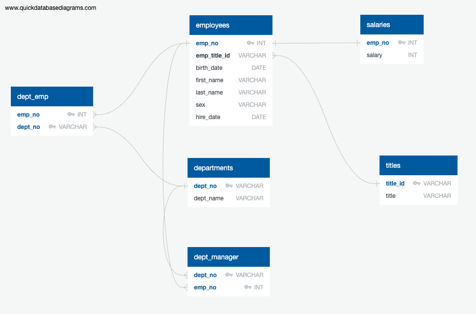

# SQL-challenge

Aim of this challenge was to conduct a research project about people whom a company employed during the 1980s and 1990s. We were tasked to work with six CSV files, creating an ERD to acheive Data Modeling, perform Data Engineering by creating individual table schemas keeping in tow with Primary Keys, Foreign Keys and Composite Keys. Finally we had to conduct Data Analysis by creating several queries to answer all the research questions. 

### Data Modeling
Inspect the CSV files, and then sketch an Entity Relationship Diagram of the tables. To create the sketch, feel free to use a tool like QuickDBDLinks to an external site..

### Data Engineering
1.  Use the provided information to create a table schema for each of the six CSV files. Be sure to do the following:

-   Remember to specify the data types, primary keys, foreign keys, and other constraints.

-   For the primary keys, verify that the column is unique. Otherwise, create a composite keyLinks to an external site., which takes two primary keys to uniquely identify a row.

-   Be sure to create the tables in the correct order to handle the foreign keys.

2. Import each CSV file into its corresponding SQL table.

### Data Analysis
1. List the employee number, last name, first name, sex, and salary of each employee.

2. List the first name, last name, and hire date for the employees who were hired in 1986.

3. List the manager of each department along with their department number, department name, employee number, last name, and first name.

4. List the department number for each employee along with that employee’s employee number, last name, first name, and department name.

5. List first name, last name, and sex of each employee whose first name is Hercules and whose last name begins with the letter B.

6. List each employee in the Sales department, including their employee number, last name, and first name.

7. List each employee in the Sales and Development departments, including their employee number, last name, first name, and department name.

8. List the frequency counts, in descending order, of all the employee last names (that is, how many employees share each last name).

## How to Install and Run the code

1. Ensure _Resources_, _data_ and _Images_ folders are present in the ***EmployeeSQL*** folder

2. Ensure files _Schema.sql_, _*Employee_Data_Analysis.sql*_ and _*Employee_ERD.png*_ image are present in the _Resources_ folder

3. The data (all csv files) required for the challenge are present in the _data_ folder

4. Images pertaining to query output are present in the _Images_ folder

5. To run the code, you will need access to PostgreSQL and pgAdmin

6. Open pgAdmin, create a database with any name like Employee_DB 

7. Open the query tool for the above created DB

8. In the query tool window, open _Schema.sql_ file from _Resources_ folder and run the code

9. After successfully running the code, ensure your tables are created using SELECT sql statements 

10. Open a new query tool to run the analysis sql file

11. Open a new query tool, open _*Employee_Data_Analysis.sql*_ file from _Resources_ folder and run each block of code to verify the results

12. Additionally, you can always modify the sql file to add more queries and play around with it for desired results.

## Credits

To complete this challenge, I had a tutoring session, where I learnt more about creating ERDs (Entity Relationship Diagrams) using QuickDBD. Also learnt about composite key and the role it plays in relation to different tables in a database. I could finish creating the ERD, import that as PostgreSQL file (Schema.sql) and use it to create my tables. 

Following that, we worked on the some queries and got some assistance from my TAs to make sure the query output looked good for submission. 

## References

https://app.quickdatabasediagrams.com/#/

https://en.wikipedia.org/wiki/Composite_key

https://www.w3schools.com/sql/sql_between.asp

https://www.w3schools.com/sql/sql_count_avg_sum.asp

https://www.w3schools.com/sql/sql_orderby.asp

 
